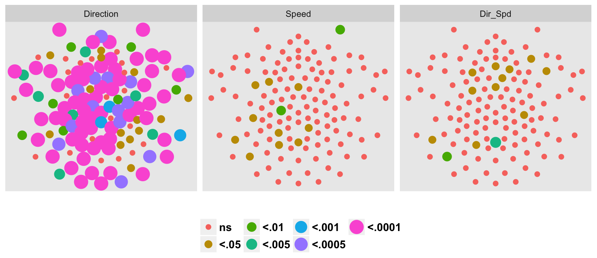
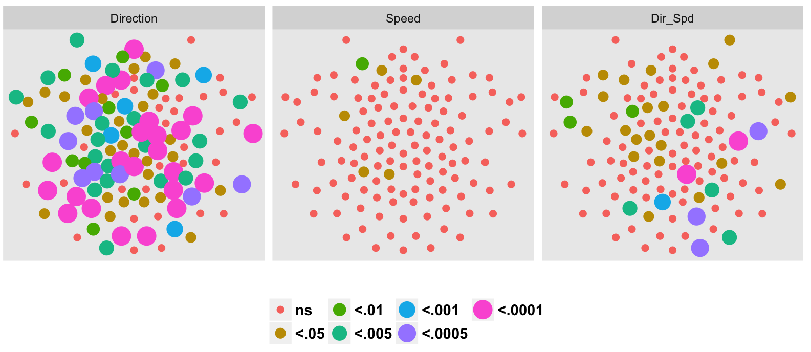
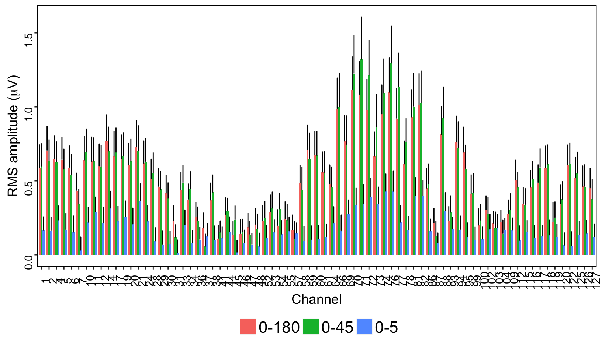
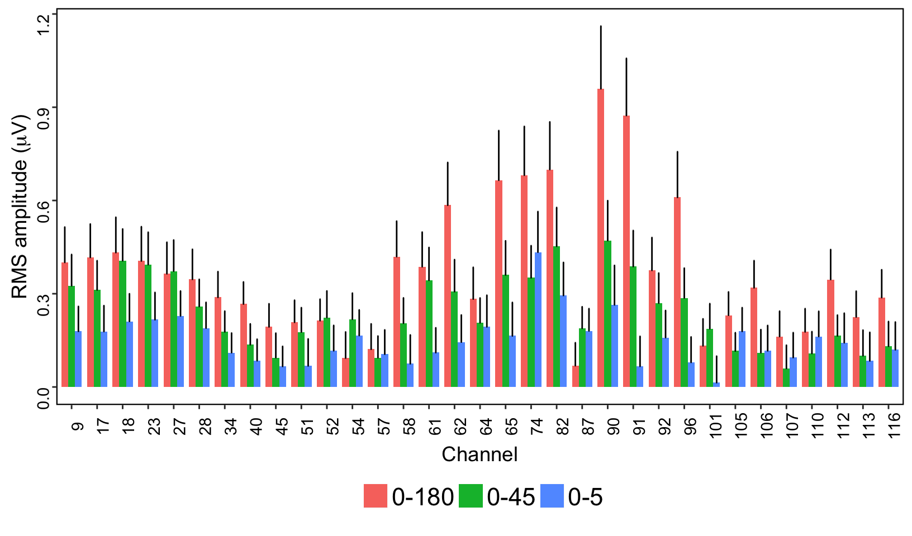
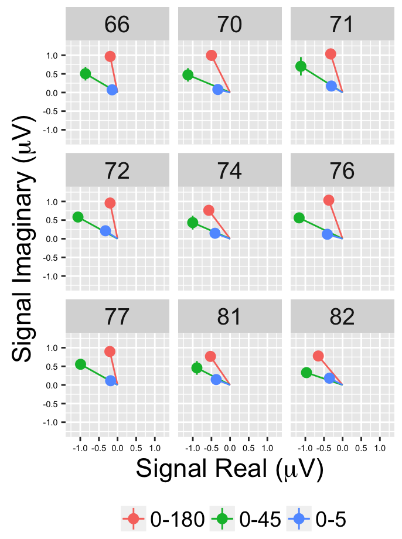

```{r setup, include=FALSE}
knitr::opts_chunk$set(echo = TRUE)
library(tidyverse)
```

# Mofo child manuscript  

- Items in bold need to be checked for accuracy.

## Methods

```{r change-iSess}
# for every file in csv-bysession, we need to change the iSess variable to the
# participant ID, which is the 3 or 4 digit number between the '-' and the '.csv'
# The following code was run once

# Change_iSess <- function(fn) {
#   new_iSess <- str_extract_all(fn, pattern = '[0-9]+')[[1]][2]
#   df <- read_csv(fn)
#   df$iSess <- as.numeric(new_iSess)
#   write.csv(df, file = paste0("analysis/data/csv-bysession-anon/", new_iSess, ".csv"), row.names = FALSE)
# }
# 
# fl <- list.files("analysis/data/csv-bysession", full.names = TRUE)
# # Change_iSess(fl[1])
# 
# sapply(fl, Change_iSess)
#
# s993 <- read_csv("analysis/data/csv-bysession-anon/993.csv")
# s993$AgeDays <- 2226
# write_csv(s993, "analysis/data/csv-bysession-anon/993.csv")
```


```{r load-data}
# to run from project root temporarily
# params$data_dir <- "analysis/data/csv-bysession-anon"
file_list <- list.files(params$data_dir, pattern = "\\.csv$", full.names = TRUE)

mofo_merged_list <- lapply(file_list, read_csv)
mofo_merged <- Reduce(function(x,y) full_join(x,y, all=TRUE), mofo_merged_list)
```

```{r calculate-demographics}
mofo_merged %>%
  select(iSess, AgeDays, Sex) %>%
  mutate(MinDays = min(AgeDays), MaxDays=max(AgeDays), MeanDays=mean(AgeDays)) ->
  age_dist

# hist(unique(age_dist$AgeDays))
# # Looks like there is an outlier with AgeDays == 22424
# unique(age_dist$iSess[age_dist$AgeDays > 5000])
# # So, we need the actual age in days for 993, from Databrary, should be 2226
# 

age_dist %>%
  group_by(Sex, iSess) %>%
  summarize(nF = n())
```


### Participants

Fifty two children participated in this study and this sample consisted of children drawn from a database of families in Centre County, Pennsylvania. Thirty-seven children, 

<!-- (`r nFemale` female; mean age: `r MeanDays/365.25` years; range `r MinDays/365.25`-`r MaxDays/365.25`)(16 female; mean age: 6.4 years)  -->

between four and nine years of age resulted in data comprising the final data set. Fifteen children were tested but excluded because of equipment failure (5), experimenter error (1), poor participant vision -strabismus (1), refusal to wear net (3), too many channels above threshold (3) and too few blocks collected (2). Children were excluded if they were born prematurely, had a history of serious visual or medical problems, epilepsy, or seizures. All children tested had normal pattern vision as evaluated with HOTV optotype acuity, a measure of visual function designed for very young participants, at a distance of 10 feet. We obtained written consent to participate from parents or guardians on behalf of the children and written assent from the children themselves under procedures approved by the Institutional Review Board of The Pennsylvania State University (#37946). The research was conducted according to the principles expressed in the Declaration of Helsinki.

### Display

All participants viewed random dot kinematogram displays on a monochrome monitor with an 800 x 600 pixel resolution and a screen refresh rate of 72 Hz. The displays were generated on a Macintosh G4 computer using Power Diva software (version 3.4, Smith- Kettlewell Eye Research Institute).

### Stimuli

Participants passively viewed random dot kinematogram displays that depicted visual forms which differed in direction from uniform background motion by 5, 45, or 180 deg, differed in coherence (0,100%) and differed in motion direction on a black background from 0 to 180 deg. All patterns were displayed in an annular region 24° in outer and 4.8° inner diameter at the 60 cm viewing distance. Four 9x9 deg square-shaped figure regions emerged from and disappeared into the background at a rate of 1.2 Hz (F1). Figure and background regions were populated with white (39 cd/m^2) dots on a black (.065 cd/m^2) background at a density of 10%; dot positions were updated at 36 Hz (F2). Each condition was presented at two speeds (1.2 and 6.0 deg/s). In order to reduce response adaptation, the direction of motion reversed **every other cycle (at 0.6 Hz)**.

### Procedures

Upon arrival at the laboratory, study and visit procedures were described and informed consent/assent was obtained. After net fitting and placement, participants were escorted to the testing room and seated on an adjustable chair in front of the computer monitor. Electrode impedances were checked, and once impedances met testing criteria (at 50kΩ or below), lights were dimmed and the session began. A research assistant remained in the testing room to monitor participants' fixation and to call for breaks, as needed. Between 3 and 10 blocks were collected for each set of 10 conditions depending on the attention span of the child. Each of the 10 conditions were presented in random order. Participants were encouraged to talk or wiggle in between blocks to help the child remain still during data collection. The entire testing session took about 45 min.

### EEG Collection

Steady-state evoked potential (SSVEP) responses were recorded using a 128-channel HydroCel Geodesic Sensor Net (Electrical Geodesics, Inc.) in conjunction with NetStation 4.1 software. Electrode impedance for each session was at or below 50 kOhms for all electrodes. EEG was **filtered at XXX**, sampled rate of 432.43 Hz, referenced to the vertex (Cz). 

### EEG analysis

PowerDiva Host 3.4 software was used offline to analyze the cortical activity related to the display of the stimuli. Artifact rejection was completed according to a sample by sample procedure where the rejected individual electrodes were eplaced with the average of the six neighboring electordes. The EEG data were then re-referenced to the net average. Amplitude modulations that exceeded 100 µV were rejected as artifact as well as entire trials that had greater than 15% of rejected cycles. The EEG patterns were analyzed using a version of the discrete Fourier transform. The frequency domain components were extracted at low order integer harmonics of the fundamental frequency (1F1=1.2 Hz) of the motion coherence modulation and the dot update rate (1F2=36 Hz) using a discrete Fourier transform algorithm. 

Phase-locked coherent averages of response amplitudes were analyzed and visualized using R 3.2.1 [71], RStudio 0.99.489 (http://www.rstudio.com), and the packages ggplot2 [72] and dplyr [73]. The complex domain (real and imaginary) components of each channel were analyzed using mixed-effects MANOVA, with direction difference and speed as fixed factors and participant as a random factor. We analyzed speed and pattern effects separately for each individual channel while choosing a conservative criterion (p<.0005) as our alpha level to reduce the likelihood of reporting false positives. Topographic visualizations of the data were created with the effects of Pattern and Speed on the VEP signal.

## Results

### Hypotheses

1. Stronger responses to larger direction contrasts (0-180).
2. Speed tuning in 1F2 at least. Have seen many times before.
3. No prediction about age effects. No strong prior hypothesis.

### Overall responsiveness of children's brains

- For each participant, summarize SNR by Condition, counting or listing of channels for SNR > 2?

```{r}
# Where s1004 is data for participant 1004
# Counts the number of channels x conditions meeting SNR thresh
#sum(s1004$SNR > 2)

# Write dplyr code to filter data frame by SNR criterion, then
# summarize
```

- Report median and range of channels meeting SNR criterion in manuscript. Look at age distributions.

- Look at $T^2_{circ}$ values at individual and group level (see Gilmore et al. 2016; Fig 3; <https://doi.org/10.1371/journal.pone.0157911.g003>). Since we're focusing on higher order harmonics, let's do plots for 1F1, 2F1, 3F1, 4F1, 5F1 and 1F2.

### Generate Channel-wise MANOVA plots

- Similar to <https://doi.org/10.1371/journal.pone.0157911.g004> and similar figures in SfN 2016 poster. 






Rerun these and also plot for 4F1, 5F1 and 1F2. 

### Generate channel effects plots






Rerun these and also plot for 4F1, 5F1 and 1F2.

### Generate statistical summary tables with effect sizes

- See Gilmore Thomas & Fesi 2016

### Generate vector average plots





Rerun these and also plot for 4F1, 5F1 and 1F2. 

## Discussion

## Conclusion


____________________________
**Language from other papers**


Data analysis focused on the phase-locked amplitude of responses at 1F1, 2F1, 3F1 ....

From Fesi 2014:

Steady-state evoked potential (SSVEP) responses were recorded via a 128-electrode dense array (SensorNet, Electrical Geodesics,
Inc.). **The electrodes were referenced to the vertex (Cz), and then re-referenced to the net average.** EEG was sampled at a rate of
443.52 Hz and low pass filtered at 50 Hz. Electrode impedance for each session was at or below 50 kOhms for all electrodes. Artifact
rejection parameters were employed to reject display cycles containing raw amplitudes that exceeded a threshold of 50 $\mu$V, as well as entire trials with 15% of rejected cycles. Activity was analyzed offline via PowerDiva Host 3.4 software. The software analyzes EEG patterns using a version of the discrete Fourier transform. Responses that occurred at integer harmonics of the modulation frequency (1.2 Hz, F1) of the displays and the monitor (24 Hz, F2) and were phase-locked to the stimulus are reported here. Topographic visualizations of the data were created with mrCurrent (Smith-Kettlewell Eye Research Institute) software. The intensity values of these plots were normalized by harmonic, in order to illustrate the spatial distribution of the responses at each harmonic. Statistical significance of signal from noise was determined via a two-dimensional t-test called the $T^2_{circ}$ (Victor & Mast, 1991).

from PLOSone -EEG Data Collection
A 128-channel HydroCel Geodesic Sensor Net (Electrical Geodesics, Inc.) was used in conjunction with NetStation 4.1 software to record SSVEP responses to the stimuli. EEG was sampled rate of 432.43 Hz, **referenced to Cz,** and the signal was low-pass filtered at 50 Hz [70] prior to analysis. Amplitude modulations that exceeded 60µV were rejected as artifact. Trials that had 15% of coherent/incoherent cycles rejected by these criteria were excluded from analysis. Children who produced fewer than three trials per condition were also excluded. A total of four children were excluded from analysis; two were excluded due to too few trials and two others were excluded due to equipment malfunction. In total, 29 children were included in the analysis (mean age=75.48 months; SD=19.18).

Analysis - from PLOSone
  To evaluate the overall responsiveness of EEG channels to motion coherence modulations, we calculated for each channel the T2Circ statistic [75], a version of Hotelling's T2 statistic adapted for frequency domain data, across participants, pattern types, and speeds. It is analogous to conducting a t test with the null hypothesis that EEG amplitudes are equal to zero. Since the T2Circ statistic could cause us to overlook channels that responded to the pattern and speed conditions with distinctive amplitude and phase profiles, we also computed a mixed-effects MANOVA (using R's manova command). Here, the real (cosine) and imaginary (sine) components of the Fourier decomposition of the EEG signal served as outcome variables. This revealed those EEG responses that were time/phase-locked to the stimulation modulations. We chose this approach in order to evaluate jointly amplitude and phase differences in the evoked responses while avoiding distributional complications with analyses based on amplitudes and phases. Specifically, amplitudes have a fixed floor at zero voltage, and phases are circularly distributed. Thus, both of these polar space quantities violate distributional assumptions that underlie standard linear statistical models. The real and imaginary components of the EEG are, under the null hypothesis, distributed symmetrically around zero, consistent with the distributional assumptions that underlie the general linear model.

Consistent with standard mixed-effects modeling procedures in the behavioral sciences, participants' mean response levels were included in the model as random intercept effects to attempt to control for individual differences in EEG response magnitudes. We used the default Pillai trace test that approximates an F distribution as the statistic of interest. To interpret the results, we chose a statistical criterion of α=.0005. This compares to a Bonferroni adjustment with n=100 tests, assuming a baseline criterion of p<.05. We report partial η values to indicate effect sizes for the MANOVA results.  For illustrative purposes we plotted (Figs 3, 6, 7, 10, and 13-15) the channel-wise results over a range of strict and liberal levels of statistical significance to illustrate how the effects varied by choices of criterion. Additional figures, full datasets, and analysis code may be found at http://doi.org/10.17910/B7QG6W and https://github.com/gilmore-lab/gilmore-thomas-fesi-2015.
